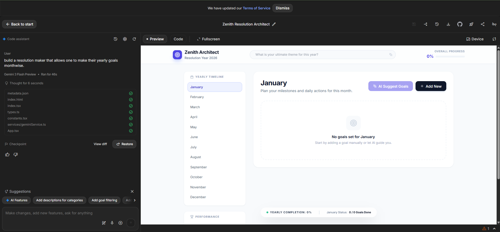
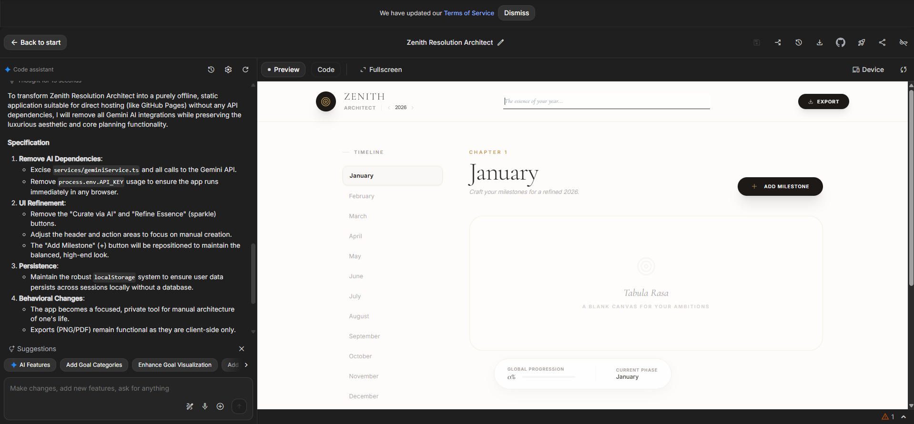
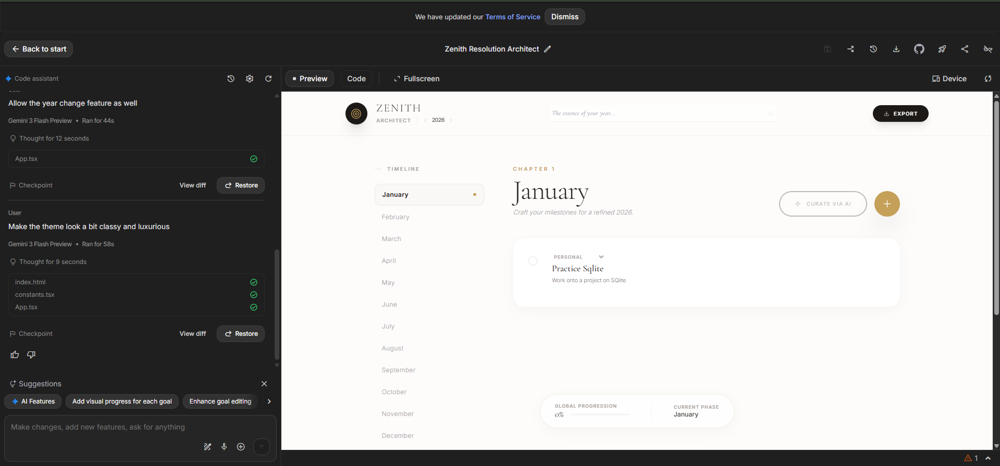
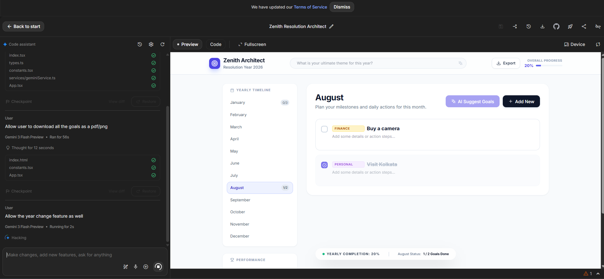

# Zenith Resolution Architect ⚜️

A masterpiece of personal planning. Designed for those who seek to architect their future with precision, luxury, and absolute privacy. Zenith transforms yearly goal-setting into a curated, month-by-month visual odyssey.

## The Development Narrative

The creation of Zenith was a journey from high-concept AI integration to a pure, "Zero-Cloud" local application. This story reflects our commitment to user privacy and aesthetic excellence.

### I. The Vision: Defining Digital Luxury
The project began with a challenge: create a resolution maker that felt like a premium stationary set. We bypassed standard UI kits to build a custom theme using the **Cormorant Garamond** serif typeface and a signature **Accent Gold (#c5a059)** palette.

*The initial design phase focused on establishing a 'breathable' interface with high-contrast typography.*

### II. The Pivot: Zero-Cloud Privacy
In a world of constant connectivity, we made the strategic choice to decommission all AI services. Zenith was rebuilt to be 100% offline-first. By utilizing `localStorage` and browser-native persistence, your aspirations remain strictly on your machine.

*Transitioning to a standalone architecture removed all external API dependencies, ensuring total privacy.*

### III. The Art of Minimalist Focus
During development, we realized that "more" was often "distraction." We removed search bars and unnecessary focus inputs to leave the user with a "Tabula Rasa" (Blank Canvas). This directs all cognitive energy toward the goals themselves.

*Streamlining the header and core workspace for an uninterrupted planning experience.*

### IV. Visual Hierarchy: Categorical Harmony
To prevent a "wall of text," we introduced a sophisticated, muted color palette for goal categories (Health, Career, Finance). These provide immediate visual feedback on life balance without breaking the luxurious aesthetic.

*Implementing color-coded milestones for better visual organization.*

### V. The Final Artifact: The High-Fidelity Export
The final phase of development involved the "Artifact Engine." Using `html2canvas` and `jspdf`, we enabled users to transform their digital plans into professional-grade PDF and PNG reports.

*A preview of the generated Yearly Report, designed for printing and physical archiving.*

## Key Features

- **Pure Offline Operation**: No account, no cloud, no tracking.
- **Dynamic Timeline**: Seamlessly navigate between months and years.
- **Global Progression Analytics**: Real-time visualization of your yearly completion stats.
- **Categorical Organization**: Tag your milestones to maintain a balanced life.
- **Luxury Export**: Download a professional "Zenith Report" of your entire year.

## Technical Stack

- **React 19**: Modern declarative UI component architecture.
- **Tailwind CSS**: Custom utility-first styling for the luxury theme.
- **Recharts**: Sophisticated data visualization for progression tracking.
- **HTML2Canvas & JSPDF**: High-fidelity client-side document generation.
- **Local Persistence**: Durable `localStorage` implementation for data safety.

---
*Zenith: Architecture for the Ambitious.*
